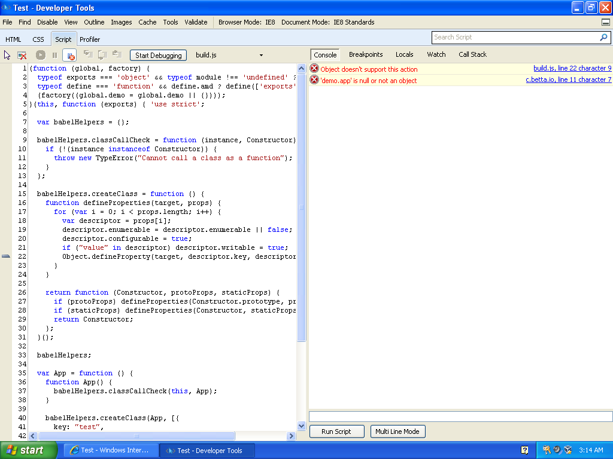

# Rollup IE8 test

## Running

```
npm install
npm start
```

## Expected result

It should render "Hello World" in the browser.

## IE8 Error

```
Object doesn't support this action
```

In `build.js`, [line 22, character 9](https://github.com/cbetta/rollup-ie8-test/blob/master/build.js#L22);


